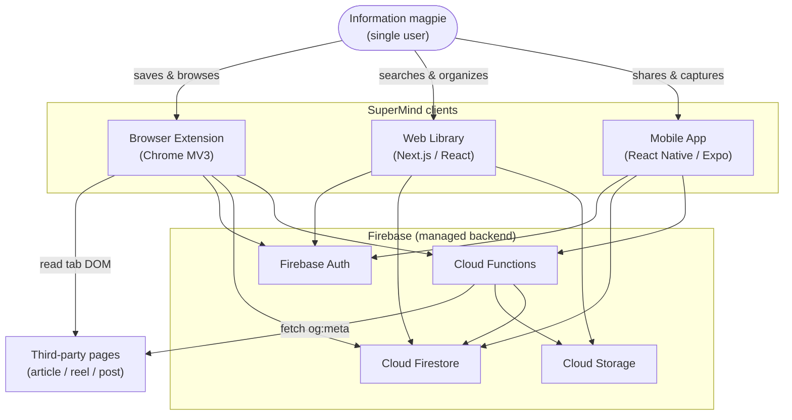
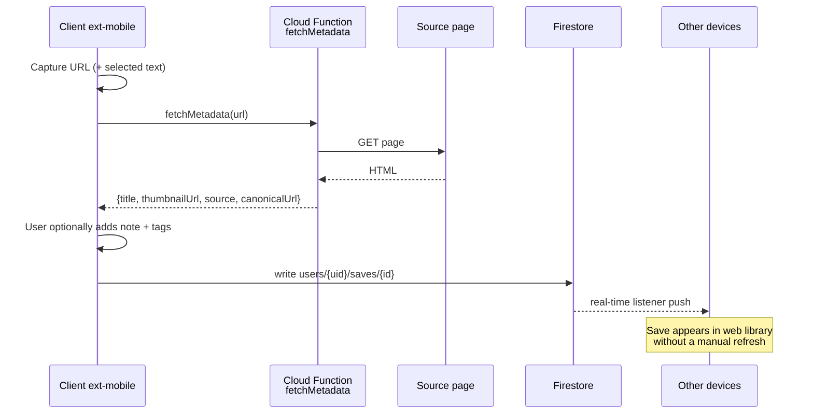
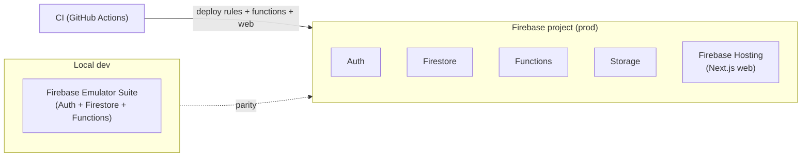

# High-Level Design — SuperMind

**Companion to:** `../PRD-SuperMind.md`
**Scope:** v1 (Tier 1) architecture on **Firebase**
**Status:** Draft v1 — for developer review
**Owner:** Sameer

> This document describes *what* the system is and how its pieces fit together at a system level. For concrete data shapes, function signatures, security rules, and per-screen flows, see `LLD.md`.

---

## 1. Purpose & context

SuperMind is a single-player second brain: capture content from any device in ≤2 seconds and reliably retrieve it later. Three thin clients talk to one managed Firebase backend. There is no custom application server — Firebase provides auth, database, sync, storage, and the one bit of server logic we need (link-metadata fetching) via Cloud Functions.

**Design principles**
1. **Managed over hand-rolled** — no server to operate; Firebase does auth, DB, sync, storage.
2. **Thin clients, shared skillset** — JavaScript/React everywhere (Next.js web, React extension, React Native mobile).
3. **Sync for free** — Firestore real-time listeners deliver cross-device sync without custom code.
4. **Retrieval is a first-class concern** — search tokens are written at save time, not bolted on later.
5. **Additive schema** — Firestore's schemaless documents let Tier 2 fields land without migrations.

---

## 2. System context (C4 — Level 1)

---

## 3. Container view (C4 — Level 2)

| Container | Tech | Responsibility |
|---|---|---|
| **Web Library** | Next.js (React), Firebase JS SDK | Primary library UI: feed, search, tag filter, item detail/edit/delete, manual add, quick capture. Also hosts the auth/login page the extension opens. |
| **Browser Extension** | Chrome Manifest V3, React popup | One-click save of the active tab; reads title / canonical URL / `og:image` / selected text from the DOM; optional note + tags; writes to Firestore. |
| **Mobile App** | React Native (Expo), Firebase JS SDK | Share-sheet target (save from any app), library view, and quick text capture. |
| **Firebase Auth** | Managed | Email/password identity shared across all clients; issues the uid every query is scoped to. |
| **Cloud Firestore** | Managed NoSQL | System of record for `saves`. Real-time listeners drive cross-device sync. Security Rules enforce per-user isolation. |
| **Cloud Storage** | Managed | Cached thumbnails and uploaded images. |
| **Cloud Functions** | Node (2nd gen) | `fetchMetadata` callable: given a URL, fetch + parse title / og:image / canonical URL server-side (avoids client CORS). Optionally caches the thumbnail into Storage. |

**Key architectural choice:** clients write to Firestore **directly** through the Firebase SDK (guarded by Security Rules), *not* through an API tier. The only server-side code is the metadata function — everything else is client → Firebase SDK → Firestore.

---

## 4. Core flows (high level)

### 4.1 Save a link (extension or mobile)

**Speed note:** the ≤2s target is met because the write is a single Firestore `set()`; metadata enrichment can complete optimistically (the card renders immediately, thumbnail fills in when the function returns).

### 4.2 Quick text capture (mobile / web)
No network round-trip for metadata — a `note`-type document is written straight to Firestore with just `text` + optional tags. One tap to open the box, type, save.

### 4.3 Browse / search / retrieve (web)
The library subscribes to `users/{uid}/saves` ordered by `createdAt desc`. Keyword search filters on the `searchTokens` array (`array-contains`); tag filter uses `array-contains` on `tags`. Real-time listeners keep the feed live.

---

## 5. Cross-cutting concerns

| Concern | v1 approach |
|---|---|
| **Auth & identity** | Firebase Auth email/password. Same uid across surfaces. Extension delegates login to the hosted web page, then shares the session. |
| **Authorization** | Firestore Security Rules: a user may read/write only under `users/{their-uid}/**`. No cross-user access path exists. |
| **Sync** | Firestore real-time listeners + on-device offline cache (SDK default). Save-then-see-on-another-device is inherent, not built. |
| **Search** | Firestore-native: `searchTokens` array written at save time, queried with `array-contains`. Prefix/token match only — full-text (Algolia/Typesense) is deferred to v2. |
| **Offline** | Firestore's local persistence queues writes and replays them on reconnect (covers the extension/mobile "offline save" edge case in Phase 4). |
| **Media** | Thumbnails referenced by URL; remote `og:image` used directly when possible, cached to Cloud Storage only when needed. |
| **Cost/scale** | Single-user v1 sits comfortably in Firebase's free tier. Firestore reads dominate cost; the live-listener feed is the main read source. |
| **Observability** | Firebase console (Auth, Firestore usage, Functions logs) is sufficient for v1. |

---

## 6. Environments & deployment (high level)

- **Web** → Firebase Hosting (or Vercel; Hosting keeps everything in one console).
- **Functions & Security Rules** → deployed via `firebase deploy` from CI.
- **Extension** → packaged & uploaded to the Chrome Web Store.
- **Mobile** → EAS Build (Expo) → TestFlight / Play Console.

---

## 7. Architecture decisions (summary)

| # | Decision | Why | Alternative rejected |
|---|---|---|---|
| AD-1 | Firebase as the sole backend | One managed service covers auth+DB+sync+storage+functions | Supabase (equivalent; team chose Firebase) |
| AD-2 | Clients write Firestore directly (no API tier) | Less code; Security Rules are the authz boundary | Custom Node/Express API |
| AD-3 | Firestore native search via `searchTokens` | Zero extra infra/cost for v1 | Algolia/Typesense (deferred to v2) |
| AD-4 | `fetchMetadata` as a Cloud Function | Consistent parsing across clients; avoids CORS | Per-client client-side parsing |
| AD-5 | React Native (Expo) for mobile | Reliable native share sheet; shared React skillset | PWA (weaker share-sheet support) |
| AD-6 | Data nested under `users/{uid}/saves` | Trivial per-user rules; automatic query scoping | Flat top-level `saves` + `where(userId==)` |

---

## 8. Out of scope for v1 (see PRD §13)

AI (tagging/summaries/semantic search), voice/OCR, Reddit/LinkedIn comment capture, resurfacing/digests/connections, sharing/collaboration, and any hand-rolled backend. The architecture is deliberately additive so these can land later without restructuring.
