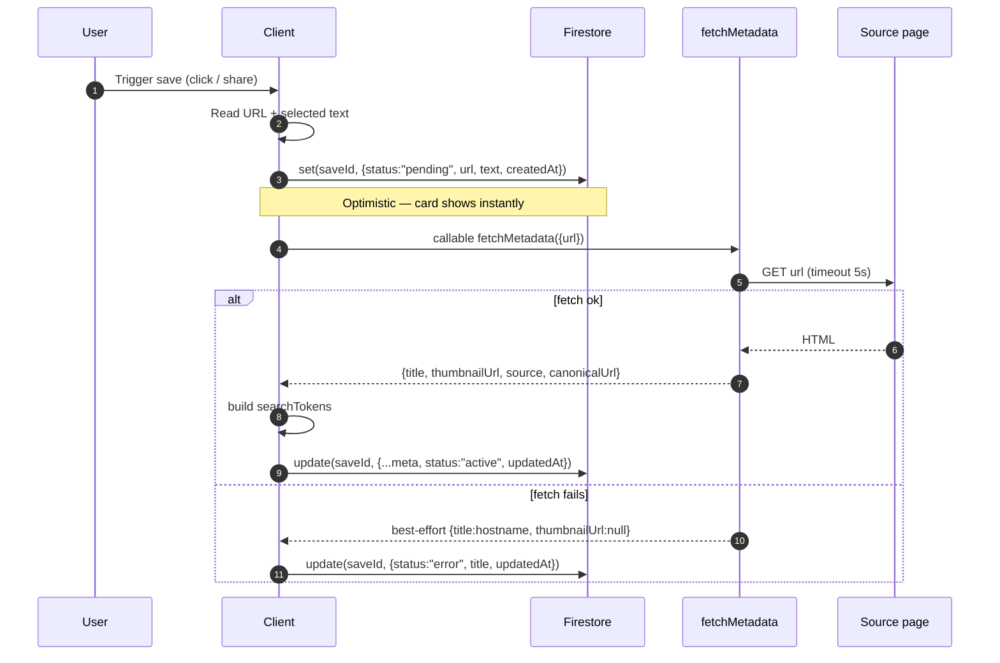
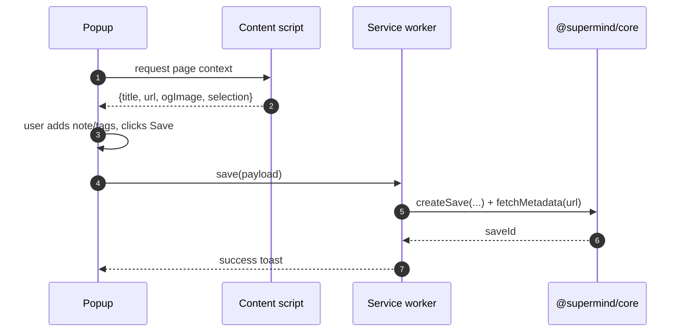
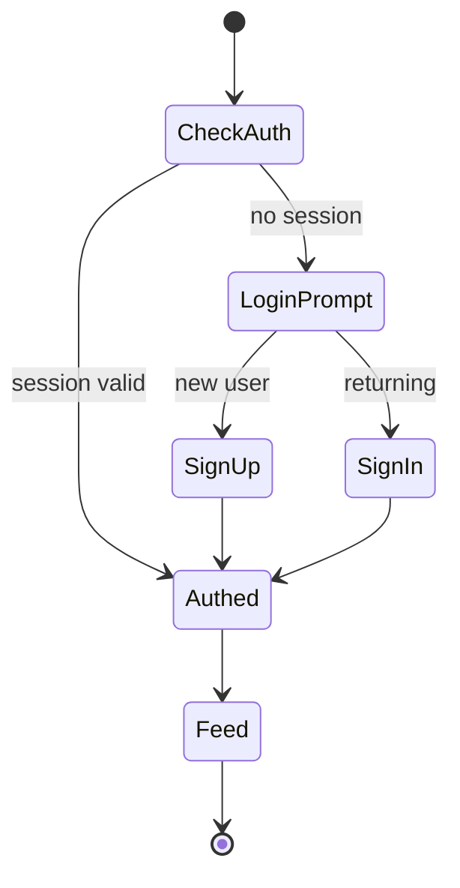
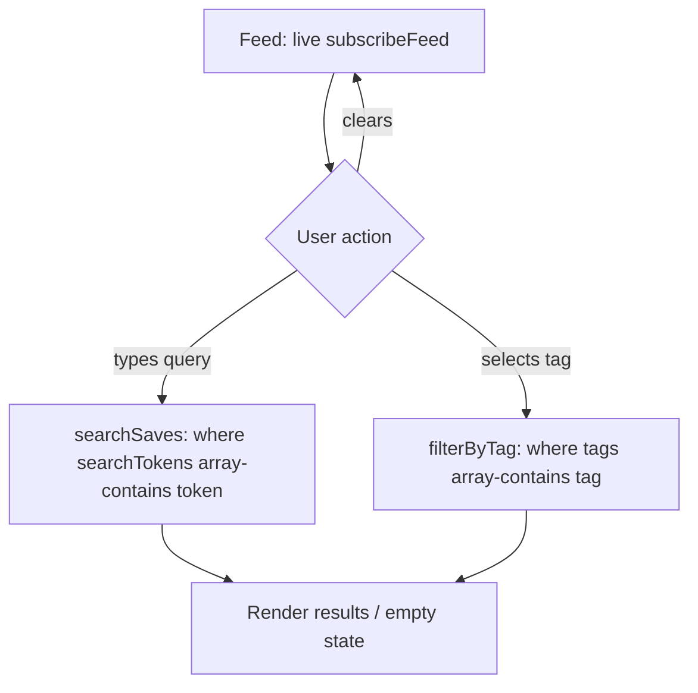

# Low-Level Design — SuperMind

**Companion to:** `../PRD-SuperMind.md`, `HLD.md`
**Scope:** v1 (Tier 1) — implementation-level design on **Firebase**
**Status:** Draft v1 — for developer review
**Owner:** Sameer

> This document is the buildable spec: exact data shapes, Firestore layout, security rules, the metadata function contract, per-client component breakdowns, and screen flows. Read `HLD.md` first for the system-level picture.

---

## 1. Firestore data model

### 1.1 Layout

```
users/{userId}                         (doc — profile / settings, minimal in v1)
└── saves/{saveId}                     (subcollection — the core collection)
```

Nesting saves under the user makes Security Rules a one-liner and scopes every query to the owner automatically.

### 1.2 `saves/{saveId}` document

```jsonc
{
  "id":           "string",            // == document id (denormalized for convenience)
  "userId":       "string",            // Firebase Auth uid
  "type":         "link | note | image",
  "title":        "string",            // auto-grabbed or user-entered
  "url":          "string | null",     // null for notes
  "source":       "string",            // e.g. "youtube.com"
  "thumbnailUrl": "string | null",     // remote og:image or Cloud Storage URL
  "text":         "string",            // note body or selected/extracted text
  "tags":         ["string"],          // lowercased, user-defined
  "searchTokens": ["string"],          // derived: lowercased unique tokens from title+text+tags
  "status":       "active | pending | error", // pending = metadata fetch in flight
  "createdAt":    "Timestamp",         // serverTimestamp()
  "updatedAt":    "Timestamp"          // serverTimestamp()
}
```

**`searchTokens` derivation** (client-side, at write time):
```
tokens = lowercase(title + " " + text + " " + tags.join(" "))
           .split(/\W+/)
           .filter(t => t.length >= 2)
           .unique()
           .slice(0, 100)   // Firestore array-contains practical cap
```

**`status`**: a save is written immediately with `status: "pending"` when metadata is still being fetched, flipped to `"active"` once enriched (or `"error"` if the fetch fails but the save is still kept). This is what lets the card render in <2s while the thumbnail fills in.

### 1.3 Required composite indexes

| Query | Index |
|---|---|
| Feed: `orderBy(createdAt desc)` | single-field (automatic) |
| Tag filter: `where(tags array-contains X) + orderBy(createdAt desc)` | composite: `tags` + `createdAt` |
| Keyword: `where(searchTokens array-contains t) + orderBy(createdAt desc)` | composite: `searchTokens` + `createdAt` |

Defined in `firestore.indexes.json`, deployed with the rules.

---

## 2. Security rules

`firestore.rules`:

```
rules_version = '2';
service cloud.firestore {
  match /databases/{database}/documents {

    match /users/{userId} {
      allow read, write: if request.auth != null
                         && request.auth.uid == userId;

      match /saves/{saveId} {
        allow read: if request.auth != null
                    && request.auth.uid == userId;

        allow create: if request.auth != null
                      && request.auth.uid == userId
                      && isValidSave(request.resource.data);

        allow update: if request.auth != null
                      && request.auth.uid == userId
                      && isValidSave(request.resource.data);

        allow delete: if request.auth != null
                      && request.auth.uid == userId;
      }
    }
  }

  function isValidSave(d) {
    return d.userId is string
        && d.type in ['link', 'note', 'image']
        && d.title is string
        && d.tags is list
        && d.searchTokens is list
        && d.createdAt is timestamp;
  }
}
```

Cloud Storage rules mirror this: a user may read/write only under `thumbnails/{uid}/**`.

---

## 3. Cloud Function — `fetchMetadata`

**Type:** HTTPS Callable (2nd gen), Node 20.

**Request**
```ts
{ url: string }
```

**Response**
```ts
{
  title: string;
  canonicalUrl: string;
  source: string;          // hostname
  thumbnailUrl: string | null;
  description?: string;    // grabbed if present; unused in v1 UI, stored for later
}
```

**Behaviour**
1. Reject if `request.auth` is null (callable auth context required).
2. Validate `url` is a well-formed http(s) URL. Reject otherwise.
3. `fetch(url)` with a timeout (~5s) and a sane User-Agent; follow redirects.
4. Parse HTML for, in priority order:
   - `title` ← `og:title` → `<title>` → hostname.
   - `thumbnailUrl` ← `og:image` → `twitter:image` → first prominent `` → `null`.
   - `canonicalUrl` ← `<link rel=canonical>` → the final resolved URL.
   - `source` ← hostname of `canonicalUrl`.
5. On any failure, return best-effort fields (never throw to client for a fetch miss) so the client can still save with `status: "error"`.

**Not responsible for** writing to Firestore — the client owns the write so offline queueing works. (v2 may move enrichment fully server-side.)

### 3.1 Save-with-metadata sequence (detailed)



---

## 4. Client architecture

### 4.1 Shared package — `@supermind/core`

A shared JS/TS module reused by all three clients (workspace package):

| Module | Contents |
|---|---|
| `firebase.ts` | Firebase app init, exported `auth`, `db`, `functions`, `storage` handles |
| `saves.ts` | `createSave()`, `updateSave()`, `deleteSave()`, `subscribeFeed()`, `searchSaves()`, `filterByTag()` |
| `tokens.ts` | `buildSearchTokens(title, text, tags)` |
| `metadata.ts` | typed wrapper over the `fetchMetadata` callable |
| `types.ts` | `Save`, `SaveType`, `SaveStatus` types |
| `auth.ts` | `signUp()`, `signIn()`, `signOut()`, `onAuthChange()` |

Keeping the Firestore read/write logic here means the three clients differ only in UI and capture mechanism.

### 4.2 Web library (Next.js)

```mermaid
flowchart TD
    subgraph Web["Next.js app"]
        RT["Route guard<br/>(onAuthChange)"]
        LOGIN["/login  /signup"]
        FEED["/  — Feed page"]
        DETAIL["/item/[id]  — Detail"]
        subgraph Comp["Components"]
            SB[SearchBar]
            TF[TagFilter]
            CARD[SaveCard]
            ADD[QuickAdd / ManualAdd modal]
        end
    end
    RT --> LOGIN
    RT --> FEED
    FEED --> SB & TF & CARD & ADD
    CARD --> DETAIL
    FEED -->|subscribeFeed| CoreDB[(@supermind/core → Firestore)]
    SB -->|searchSaves| CoreDB
    TF -->|filterByTag| CoreDB
    ADD -->|createSave| CoreDB
    DETAIL -->|updateSave / deleteSave| CoreDB
```

**Feed page state:** subscribes via `subscribeFeed(uid, {limit})` → live array of `Save`. Search and tag filter swap the active query. Empty state renders when the feed is empty and no filter is active.

### 4.3 Browser extension (Chrome MV3)

| Component | Role |
|---|---|
| `manifest.json` | MV3; permissions: `activeTab`, `scripting`, `storage`; host permission for the metadata function; action popup |
| **Popup** (React) | Shows captured title/thumbnail, note + tag inputs, Save button, auth state |
| **Content script** | Injected on demand to read `document.title`, canonical link, `og:image`, `window.getSelection()` |
| **Background service worker** | Holds the Firebase session; performs the Firestore write; keyboard-shortcut command handler |

**Auth handoff:** the popup checks for a session; if none, it opens the hosted web `/login`. On success the session token is stored (via the web app's shared Firebase auth domain) and the popup reads it. (Exact token-sharing mechanism is an implementation detail flagged in §7.)



### 4.4 Mobile app (React Native / Expo)

| Piece | Role |
|---|---|
| **Share Extension** (iOS) / **Share Intent** (Android) | Registers SuperMind as a share target; receives shared URL/text; opens a lightweight save sheet |
| **Auth screens** | signup / login via `@supermind/core` |
| **Library screen** | `subscribeFeed` list of `SaveCard`s; pull-to-refresh (though listener is live) |
| **Quick Capture** | FAB → text box → `createSave({type:"note"})` in ≤2 taps |
| **Save sheet** | Shown from share intent; prefilled from shared payload; note/tags; confirm |

Expo config: `expo-share-intent` (or a config plugin) to wire the native share targets; `expo-router` for navigation; Firebase JS SDK for data.

```mermaid
flowchart LR
    OtherApp["Instagram / YouTube / Browser"] -->|Share →| SI[Share Intent handler]
    SI --> SHEET[Save sheet]
    SHEET -->|createSave + fetchMetadata| Core[(@supermind/core → Firestore)]
    FAB[Quick Capture FAB] --> NOTE[Note box] -->|createSave note| Core
    LIB[Library screen] -->|subscribeFeed| Core
```

---

## 5. Key screen flows

### 5.1 First run / auth (all surfaces)



### 5.2 Search & tag filter (web feed)



Multi-token search v1 behaviour: query is tokenized; run `array-contains-any` on up to 10 tokens, then client-side rank by number of tokens matched. Documented as a known limitation vs. true full-text (v2).

---

## 6. Non-functional details

| Aspect | v1 spec |
|---|---|
| **Save latency target** | ≤2s perceived. Met via optimistic write (`status:"pending"`) before metadata resolves. |
| **Offline** | Firestore SDK local persistence enabled on all clients; writes queue and replay. Phase-4 polish item. |
| **Duplicate saves** | Phase-4: soft-detect by canonical URL within a user's saves; warn, don't block. |
| **Pagination** | Feed loads newest N (e.g. 30) with `limit()`, infinite-scroll `startAfter(lastDoc)`. |
| **Error handling** | Failed metadata → `status:"error"`, item still saved and editable. Failed write (offline) → queued, toast informs. |
| **Config/secrets** | Firebase web config is public by design; security is in Rules. Functions use env config for any keys. |

---

## 7. Open implementation questions (flag at kickoff)

1. **Extension ↔ web auth token sharing** — cleanest MV3 approach: `chrome.identity` vs. reading the web app's Firebase session via a shared auth domain vs. an in-popup login. Decide before building Phase 2.
2. **Thumbnail storage policy** — reference remote `og:image` directly (cheaper, can rot) vs. always cache to Cloud Storage (durable, costs storage). v1 default: reference remote, cache lazily only on failure.
3. **Multi-word search ranking** — the `array-contains-any` + client-rank approach is a v1 compromise; confirm it's acceptable before Phase 1 sign-off.
4. **Monorepo tooling** — confirm the `@supermind/core` shared package lives in a workspace (pnpm/turborepo) consumed by all three clients.
5. **Auth providers** — email/password only for v1 (PRD OQ #4 still open); if Google/Apple is added, Apple Sign-In becomes App-Store-mandatory for the mobile app.

---

## 8. Build order (maps to PRD §9)

| Phase | LLD deliverables |
|---|---|
| **0 — Foundation** | Firebase project, Auth, Firestore rules + indexes, `@supermind/core`, `fetchMetadata` function, emulator setup. Prove a write from a throwaway button syncs to another client. |
| **1 — Web** | Next.js: auth guard, feed (`subscribeFeed`), manual add, search, tags, detail/edit/delete, empty state. |
| **2 — Extension** | MV3 popup + content script + service worker; auth handoff; one-click save. |
| **3 — Mobile** | Expo app: auth, library, quick capture, share intent save sheet. |
| **4 — Polish** | Offline queue, duplicate detection, pagination, multi-token search tuning. |
